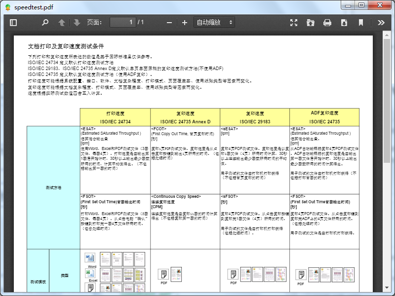

# Electron pdf viewer

A node module for view pdf file in electron applications.

##Introduction
elpdfview module use third party pdf.js library. 

When you create a new pdfview object, You get a BrowserWindow instance back from the call.

##Install
    
    npm install elpdfview --save

## Usage

Used with pdf.js in render process in electron.

	var pdfview = require('elpdfview');
	
	//set pdf path
    var pdfurl ='https://www.canon.com.cn/products/printer/pixma-fax/images/speedtest.pdf';    
    var win = pdfview.showpdf(pdfurl);
